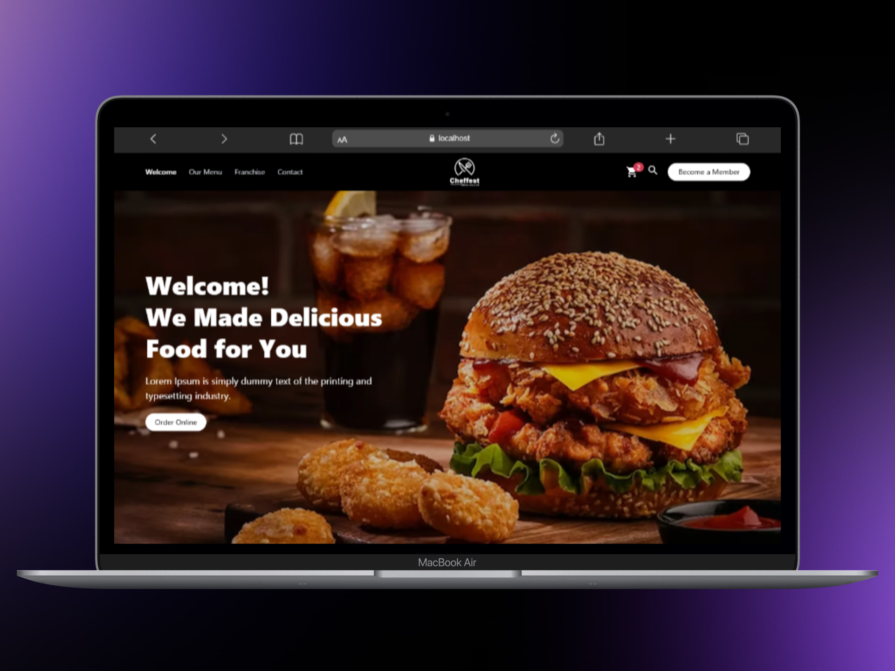
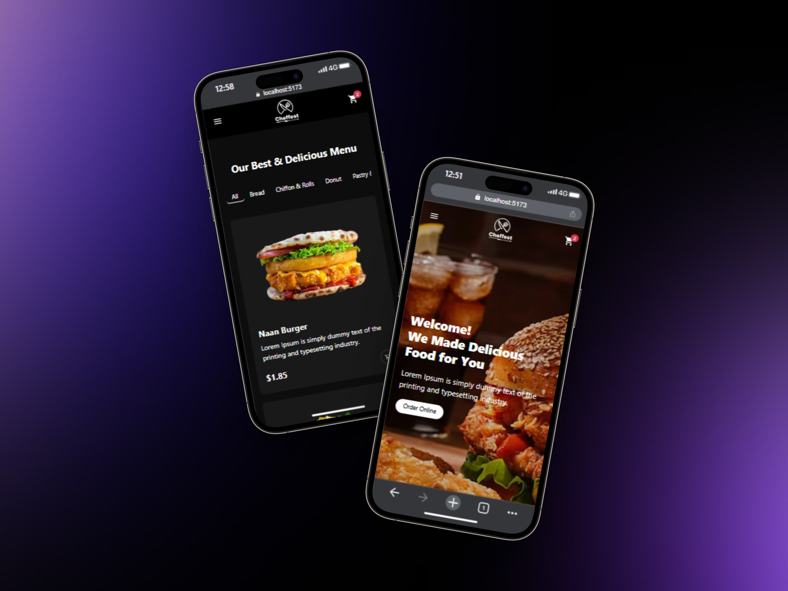

# Restaurant Landing Page

This is a landing page for a restaurant, built with Vue.js, Vite, and TypeScript.


_Captura de pantalla de la web en un PC._


_Captura de pantalla de la web en un teléfono._

## Technologies Used

- [Vue.js](https://vuejs.org/)
- [Vite](https://vitejs.dev/)
- [TypeScript](https://www.typescriptlang.org/)
- [Vue Router](https://router.vuejs.org/)
- [Tailwind CSS](https://tailwindcss.com/)

## Project Setup

1.  Clone the repository:
    ```bash
    git clone https://github.com/cristianvasquezc/restaurant-landing.git
    ```
2.  Navigate to the project directory:
    ```bash
    cd restaurant-landing
    ```
3.  Install dependencies:
    ```bash
    npm install
    ```

## Development Server

To run the development server, use the following command:

```bash
npm run dev
```

This will start the server, typically at `http://localhost:5173`.

## Build

To create a production build of the project, run:

```bash
npm run build
```

This will create a `dist` directory with the compiled files.

## Preview

To preview the production build locally, run:

```bash
npm run preview
```
